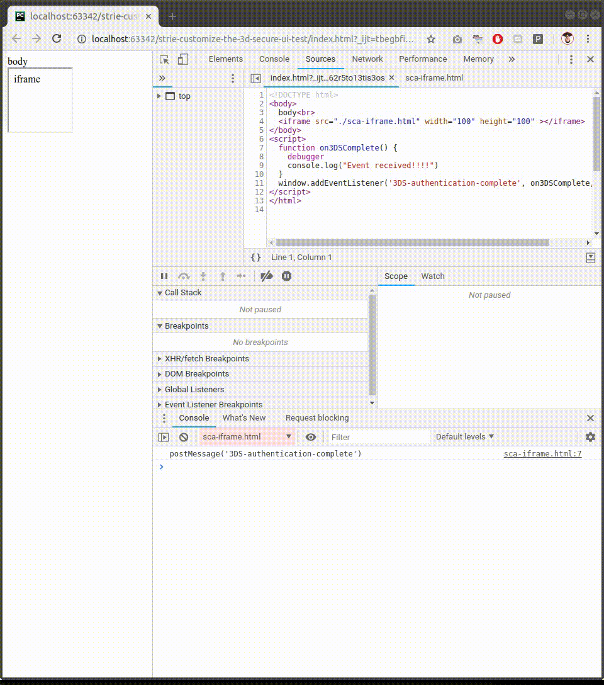

# `addEventListener` and `postMessage` doesn't work, as suggested by Stripe documentation

I've followed examples from Stripe documentation, however for some reason, suggested way does not work:
https://stripe.com/docs/payments/3d-secure-iframe#handle-redirect

